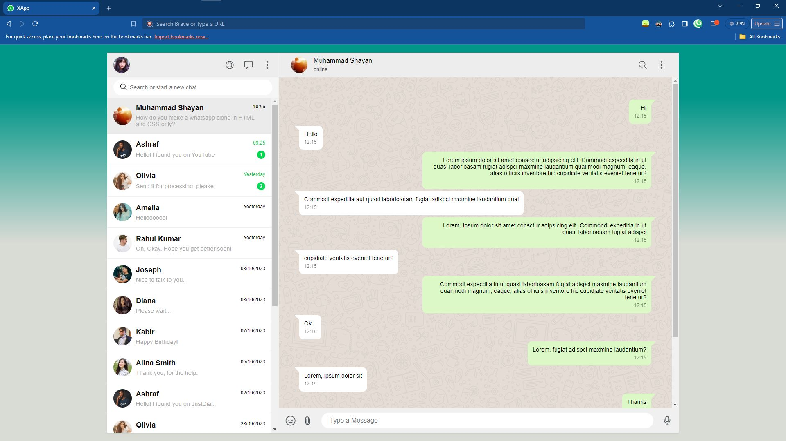
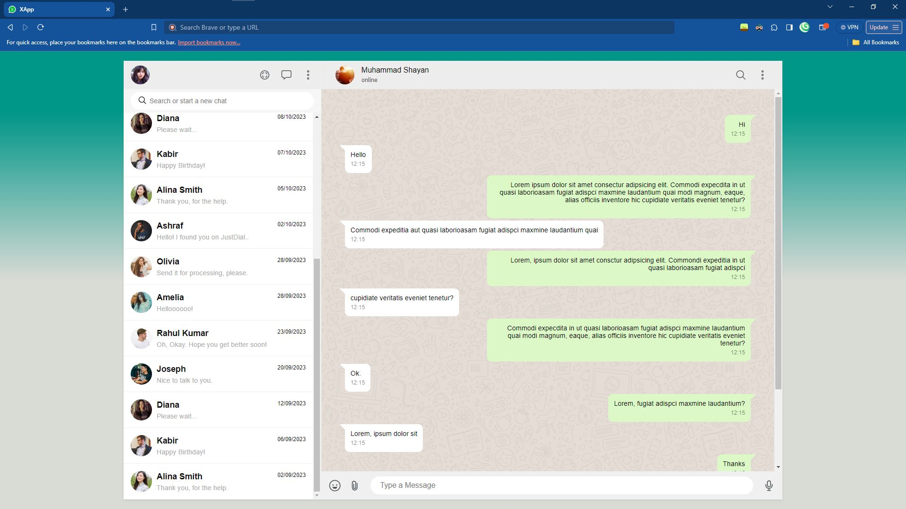

# XApp

A clone of the WhatsApp  chat website.
This is a backup for my hard-disk, just incase they fail. And a place to start from for you.

The assets can be found: [here](https://drive.google.com/drive/folders/1yloKPnGcGzhViZVD-At3PNf4kaz60nRT?usp=sharing)

**(Thanks Online Tutorials!)**

## Acknowledgements

- Tutorial by [Online Tutorials](https://youtube.com/@onlinetutorialsyt?si=S2yECqxwv_jNZZl9)

- Huge shout-out to my youngest project, as of writing this: [XCord](https://github.com/l-xdt/xcord/)

- A huge help in this project: [Diffchecker](https://www.diffchecker.com/)

## Authors

- [LeidenSchaft-Xiotim Development Team](https://www.github.com/l-xdt/)

- [Alvin Maranx, II ツ (Avun)](https://www.github.com/avun-ai/)

- [Online Tutorials](https://youtube.com/@onlinetutorialsyt?si=S2yECqxwv_jNZZl9)

## Demo

There is a demo on this project! And I'm not being indirect, here is the link: click [here](https://l-xdt.github.io/xapp/)

## Features

- Message bubbles.

- Changeable avatars.

- Change the UI colours.

- Change Messages.

- **PS:** A little more features added, but still needs more input.

## Screenshots





**Written in plain HTMLans CSS. The rest you have to figure out.**

## Run Locally

Clone the project

```bash
  git clone https://github.com/xapp/
```

Go to the project directory

```bash
  cd xapp
```

Install XAMPP (via Chocolatey, if you don't have it.)

```bash
  chocolatey install xampp
```

Start the server

```bash
    [Directory]/[ServerName]/apache-start.bat
```

**PS**: If you trust your web skills, here is a manual on how to self-host a domain: [here](https://www.youtube.com/watch?v=_eQGAJVtRCs) (by Soeng Souy)

## Roadmap

- Additional browser support.

- Change the message handles to what you want.

- Change the online and offline texts to be what you would like.

- Change the main colours.

- Change the code you would like to.

- Change what icons you want to see.

- Change the FavIcon, inspired of course by our Signature: **X**

- Written in **Vanilla HTML and CSS**

## Support

For support, reach out to us via either of our emails: [this one](mailto:trowesigames@gmail.com) or [this one](mailto:leidenschaft.tech@hotmail.com) or join our Discord Group: which is not up as of writing this readMe.

## Feedback

This still applies to feedback as well, Whether you want to give us positive words or negative ones, send away. (but please only send constructive-critism).

Send away:  [here](mailto:trowesigames@gmail.com) or [here](mailto:leidenschaft.tech@hotmail.com).

## FAQ

**Now, my fav, FAQ!**

#### Can I modify this to fit my needs?

Exactly! This is what we made this repository for. This for you to tinker and experiment with.

#### Can I host this? If I can, how?

You can, with my favourite sever (based-off Apache), XAMPP! I have explained it 3,001 times, but here is the rundown.

Apache (contained in XAMPP) uses the IP that redirects you back to your computer (127.0.0.1) to host your little websites.

If you want to go ahead with it, you can get started with hosting by clicking [here](https://www.youtube.com/watch?v=LzucEZh4_no) and following the tutorial by MainlyWebStuff.

And if you still want a custom domain, click [here](https://www.youtube.com/watch?v=_eQGAJVtRCs) to follow the tutorial by Soeng Souy.

## Used By

This project is used by the following companies:

- LeidenSchaft-Xiotim Acquisitions (Limited)

- XDT-Studium

- Xiotim Development Team [Limited] (XDT)

- XDT-noHesi

## Related

Here are some related projects:

- [XioTok](https://github.com/l-xdt/xiotok/)

- [noHesi](https://github.com/l-xdt/no-hesi/)

- [Xirox](https://github.com/l-xdt/xirox/)

- [Studium](https://github.com/l-xdt/studium/)

- [XioTim](https://github.com/l-xdt/xiotim/)

- [XioTube](https://github.com/l-xdt/xiotube/)

- [xSocial](https://github.com/l-xdt/xSocial/)

- [XGram](https://github.com/l-xdt/xgram/)

- [XChat](https://github.com/l-xdt/xchat/)

- [XCord](https://github.com/l-xdt/xcord/)
  
  ## Documentation

- Although I cannot tell you all about the project (yet), you can go and check out the tutorial, linked below:

- [WhatsApp Clone](https://youtu.be/2vfT5nwNvNo?si=BkU8etYzLo5ZAgL_) by Online Tutorials (on YouTube)

## API Reference

As earlier referenced, there is no APIs and/or Frameworks, let alone any JavaScript. This is a very base-level, if there is any. I will update this readMe.
